# Crazy Calvin’s Kangaroo Rides 
## A web application for making reservations

A web application to help Calvin, the business owner of 'Crazy Calvin’s Kangaroo Rides' to manage his crazy kangaroo rides. The entire website has been desiged to be responsive and mobile-friendly to accommodate adventure seekers from all devices.

The website includes the following main sections.

### Registration Page
Customers can use this page to book a new reservation. After entering the relevant ride information into the form they will see a confirmation screen with information they entered along with a confirmation code.   

Front-end validations are performed on the following mandatory fields:
* First and Last Name
* Email address
* Phone Number (with area code)
* Ride Type
* Ride Date 
* Ride Time

Back-end validations include : 
* Validity of the required fields
* No registration with duplicate Email, First and Last Name
* No booking beyond the allowed number of reservations per slot

If the submission fails validation, a message (along with the reason) is shown to the customer that their submission has failed so they can correct and resubmit it. 

If the submission is successful, a success message is displayed to the customer with the confirmation code. 

### Admininstration Page
The administrator can use this page to perform the following tasks: 
* View the summary of all the reservations at once.
* View, update or cancel an individual reservation.
* Add new types of rides as the business grows.
* Change the allowed reservations per slot to scale up the business. **Sold out time-slots will not be shown in the "Available Slots" options on the New Reservation page**.

## Screenshots

* New Reservation Page | **Mobile Device - Responsive**

  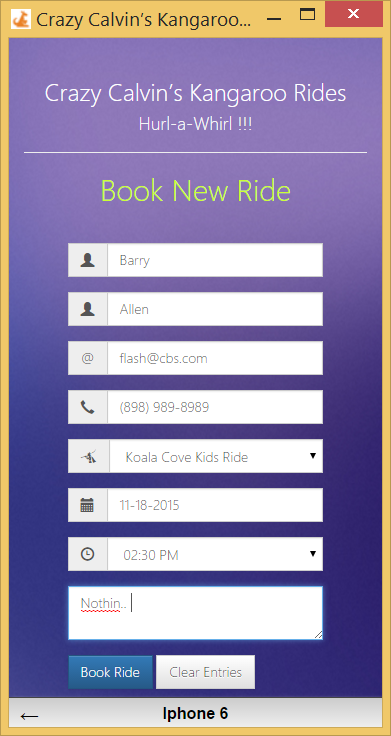

  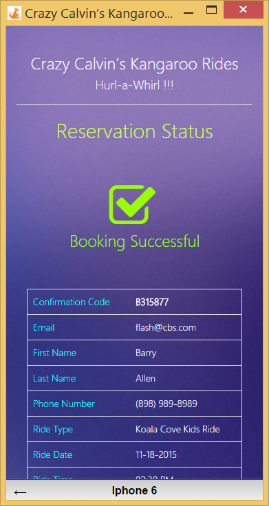

* New Reservation Page | **Desktop version**

  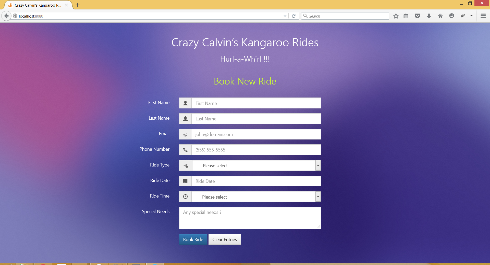

* New Reservation Page | **Validations**

  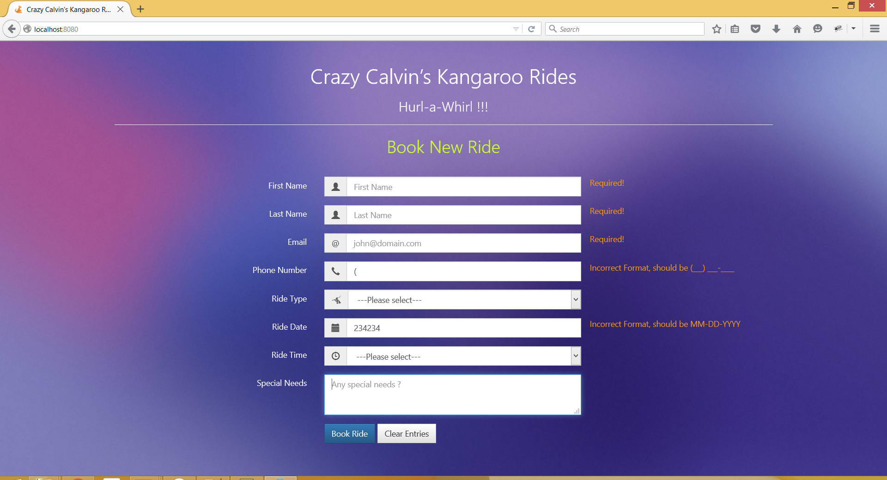

* New Reservation Page | **Duplicate Reservation Error**

  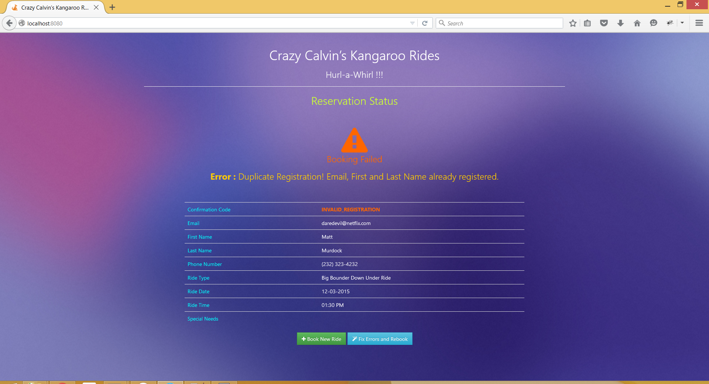

* Admin Page | **Add New Rides**

  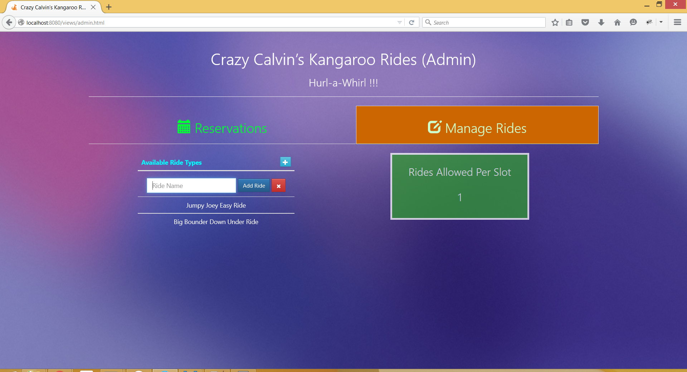

* Admin Page | **Change Allowed Rides / Slot**

  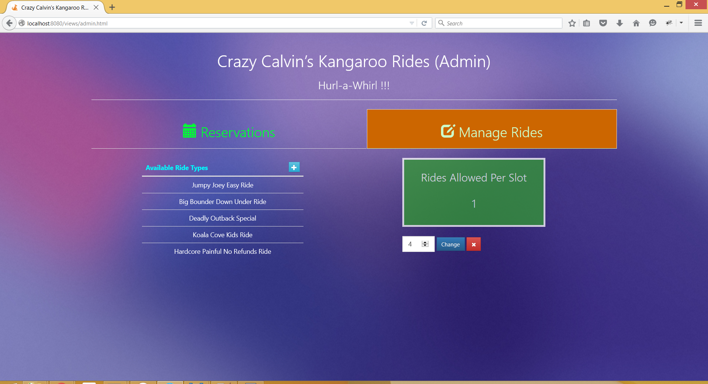

* Admin Page | **Reservations Summary**

  * Columns can be sorted by clicking on them. 
  * Pagination thresohld (reservations displayed per page) is customizable.

  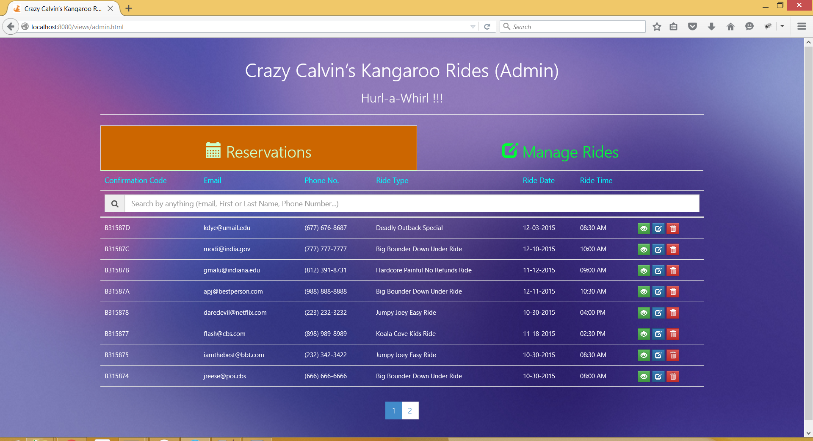

* Admin Page | **Search** existing reservations with any of the following
  * Confirmation Code
  * Email
  * First Name or Last Name
  * Phone Number
  * Ride Type
  * Ride Date
  * Ride Time

  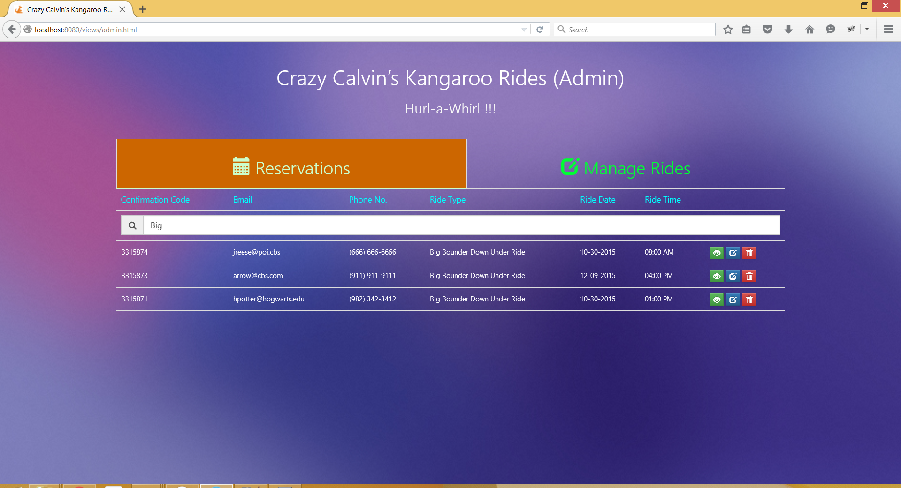

* Admin Page | **View Reservation**

  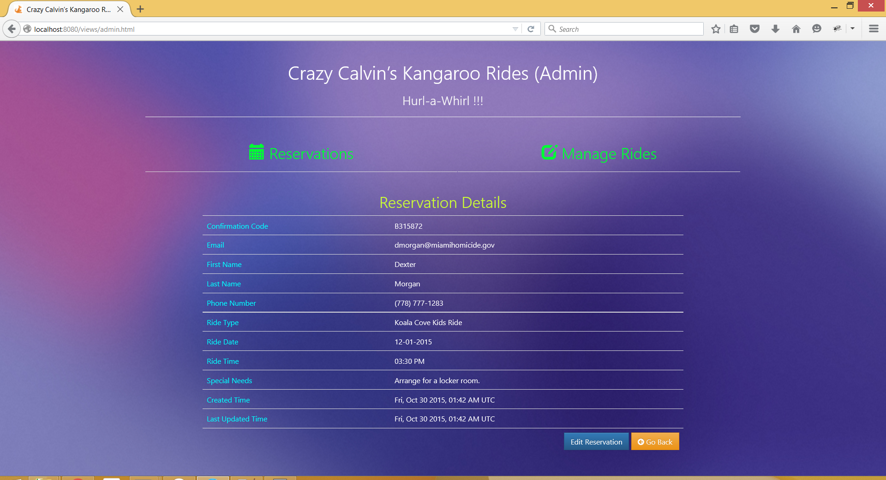

* Admin Page | **Edit Reservation**

  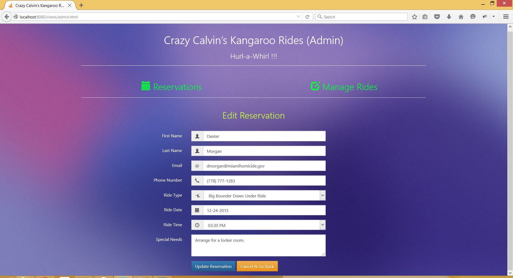

* Admin Page | **Delete Reservation**

  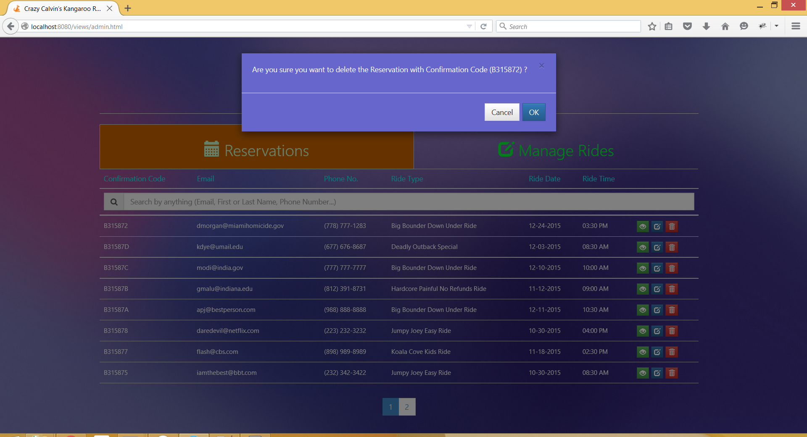

* **404 Page**

  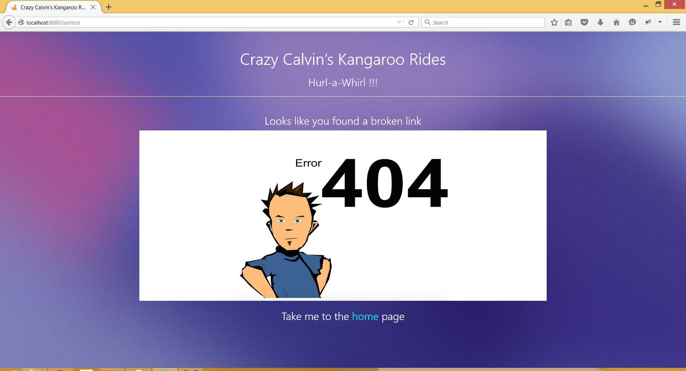


## Installation
Follow the below steps after cloning the repository

### MongoDB - Setup
1. Download and install MongoDB (version 3.0.x) from the official [page](https://www.mongodb.org/downloads#production)

2. Follow the installation instructions from the [link](https://docs.mongodb.org/manual/tutorial/)

3. Use screen (on UNIX server) to open a session and start the Mongo server and Node server. Screen can help in keeping remote sessions open. More information can be found [here](https://www.gnu.org/software/screen/manual/screen.html)
4. (If on UNIX server, use new Screen session) Start Mongo server on the port `8097` (port number required to connect from Node server)  
 
    ```
    $> ~\mongodb\bin\mongod --port 8097 --dbpath < ~\KangarooRideBookingApp\data >
    ```
    Specifying `--dbpath <path>` is optional. In this case, all the website data related to this application is being stored under the parent directory KangarooRideBookingApp
    
5. The following output can be seen if the Mongo server has started successfully
 
    ```
    2015-10-29T19:23:30.524-0400 I JOURNAL  [initandlisten] journal dir=C:\Users\gmalu\Documents\GitHub\KangarooRideBookingApp\data\journal
    2015-10-29T19:23:30.525-0400 I JOURNAL  [initandlisten] recover : no journal files present, no recovery needed
    2015-10-29T19:23:30.552-0400 I JOURNAL  [durability] Durability thread started
    2015-10-29T19:23:30.552-0400 I JOURNAL  [journal writer] Journal writer thread started
    2015-10-29T19:23:30.666-0400 I CONTROL  [initandlisten] MongoDB starting : pid=2488 port=8097 dbpath=C:\Users\gmalu\Documents\GitHub\KangarooRideBookingApp\data 64-bit host=malughanshyam
    2015-10-29T19:23:30.666-0400 I CONTROL  [initandlisten] targetMinOS: Windows 7/Windows Server 2008 R2
    2015-10-29T19:23:30.667-0400 I CONTROL  [initandlisten] db version v3.0.7
    2015-10-29T19:23:30.667-0400 I CONTROL  [initandlisten] git version: 6ce7cbe8c6b899552dadd907604559806aa2e9bd
    2015-10-29T19:23:30.667-0400 I CONTROL  [initandlisten] build info: windows sys.getwindowsversion(major=6, minor=1, build=7601, platform=2, service_pack='Service Pack 1') BOOST_LIB_VERSION=1_49
    2015-10-29T19:23:30.667-0400 I CONTROL  [initandlisten] allocator: tcmalloc
    2015-10-29T19:23:30.668-0400 I CONTROL  [initandlisten] options: { net: { port: 8097 }, storage: { dbPath:.....\GitHub\KangarooRideBookingApp\data" } }
    2015-10-29T19:23:30.688-0400 I NETWORK  [initandlisten] waiting for connections on port 8097
    
    ```
    
6. (Optional) Sample mongo queries to test the data once the website is deployed

    ```sh
    // Connect via mongo client
    $>~\mongodb\bin\mongo --port 8097  KangarooRides
    
    // Find documents
    > db.Reservations.find().pretty()
    > db.RideManager.find().pretty()      
    ```


### Node.js - Setup
1. Download and install Node.js from the official [page](https://nodejs.org/en/download/)
2. Navigate to the `KangarooRideBookingApp` directory, execute the following command to install the node dependencies 
    
    ```sh 
    npm install 
    ```
    
3. (If on UNIX server, use new Screen session) Start Node.js server 
    
    ```sh 
    node server.js 
    ```
    
    The server is up and running if you see the below output
    ```
    info: [Log]  ***** Server Started *****
    KangarooRideBookingApp Server App listening on port 8080
    
    ```


## Usage
* [New Booking Page](public/views/home.html) - `HostServerAddress:8080/` or `HostServerAddress:8080/views/home.html`
* [Administrator Page](public/views/admin.html) - `HostServerAddress:8080/views/admin.html`
* [404 Page](public/views/404.html) (Any broken link will land here) - `HostServerAddress:8080/views/404.html`

If the website is deployed on a desktop/local machine, use `localhost` in place of `HostServerAddress`.

